# 📚 Parte 3: Documentación CRUD con Axios

Esta documentación explica cómo realizar operaciones **CRUD** sobre la colección `students` usando **Node.js** y **Axios**. 

Cada sección incluye explicación detallada y ejemplos de ejecución.

> ⚡ **Nota:**  
> La URL base de la API se configura en `.env` o por defecto es: `http://localhost:4000/students`.

---

## 3.1 📖 Sección CRUD

### 1. CREATE (POST)

🏷 **Título:** Crear un nuevo estudiante  

📝 **Descripción:** Envía un objeto JSON al servidor para crear un nuevo estudiante en la colección `students`. El servidor devuelve el objeto creado con un ID asignado automáticamente.

💻 **Comando equivalente en Node.js (Axios):**
```js
await createStudent({
  id: "8",
  name: "Thomas Anderson",
  email: "neo@matrix.com",
  enrollmentDate: "2025-01-20",
  active: true,
  level: "advanced"
});
```

🔍 **Explicación del comando:**

| Parte | Qué hace | 🎯 Por qué se usa | 📨 Headers |
|-------|----------|-----------------|------------|
| `axios.post(BASE_URL, studentData)` | Envía la solicitud POST con los datos | POST crea un recurso nuevo | `Content-Type: application/json` (automático con axios si es JSON) |

✅ **Respuesta simulada:**
```json
{
  "id": "8",
  "name": "Thomas Anderson",
  "email": "neo@matrix.com",
  "enrollmentDate": "2025-01-20",
  "active": true,
  "level": "advanced"
}
```

📊 **Código de estado HTTP esperado:** **201 Created** → El recurso se ha creado correctamente.

---

### 2. READ ALL (GET)

🏷 **Título:** Leer todos los estudiantes  

📝 **Descripción:** Recupera la lista completa de estudiantes de la colección `students`.

💻 **Comando Axios:**
```js
await readAllStudents();
```

🔍 **Explicación:**

| Parte | Qué hace | 🎯 Por qué se usa | 📨 Headers |
|-------|----------|-----------------|------------|
| `axios.get(BASE_URL)` | Solicita todos los registros | GET recupera recursos | Ninguno especial, JSON por defecto |

✅ **Respuesta simulada:**
```json
[
  { "id": 1, "name": "Alice", "email": "alice@mail.com" },
  { "id": "8", "name": "Thomas Anderson", "email": "neo@matrix.com" }
]
```

📊 **Código de estado HTTP esperado:** **200 OK** → Solicitud exitosa.

---

### 3. READ BY ID (GET)

🏷 **Título:** Leer un estudiante por ID  

📝 **Descripción:** Obtiene los datos de un estudiante específico según su `id`.

💻 **Comando Axios:**
```js
await readStudentById(8);
```

🔍 **Explicación:**

| Parte | Qué hace | 🎯 Por qué se usa | 📨 Headers |
|-------|----------|-----------------|------------|
| `axios.get(`${BASE_URL}/${id}`)` | Solicita un recurso concreto | GET obtiene un recurso específico | Ninguno |

✅ **Respuesta simulada:**
```json
{
  "id": "8",
  "name": "Thomas Anderson",
  "email": "neo@matrix.com",
  "enrollmentDate": "2025-01-20",
  "active": true,
  "level": "advanced"
}
```

📊 **Código de estado HTTP esperado:** **200 OK** → Recurso encontrado correctamente.

---

### 4. UPDATE COMPLETO (PUT)

🏷 **Título:** Reemplazar un estudiante (Actualización completa)  

📝 **Descripción:** Reemplaza todos los campos de un estudiante existente usando los datos proporcionados.

💻 **Comando Axios:**
```js
await updateStudent(8, {
  id: 8,
  name: "Samuel F. Enríquez [ACTUALIZADO]",
  email: "samuel.fernan@email.com",
  enrollmentDate: "2025-11-02",
  active: true,
  level: "advanced"
});
```

🔍 **Explicación:**

| Parte | Qué hace | 🎯 Por qué se usa | 📨 Headers |
|-------|----------|-----------------|------------|
| `axios.put(`${BASE_URL}/${id}`, updatedStudent)` | Reemplaza todo el registro | PUT reemplaza recurso completo | `Content-Type: application/json` |

✅ **Respuesta simulada:**
```json
{
  "id": 8,
  "name": "Samuel F. Enríquez [ACTUALIZADO]",
  "email": "samuel.fernan@email.com",
  "enrollmentDate": "2025-11-02",
  "active": true,
  "level": "advanced"
}
```

📊 **Código de estado HTTP esperado:** **200 OK** → Recurso actualizado correctamente.

---

### 5. UPDATE PARCIAL (PATCH)

🏷 **Título:** Actualización parcial de estudiante  

📝 **Descripción:** Modifica únicamente los campos indicados sin reemplazar todo el recurso.

💻 **Comando Axios:**
```js
await patchStudent(8, { level: "beginner" });
```

🔍 **Explicación:**

| Parte | Qué hace | 🎯 Por qué se usa | 📨 Headers |
|-------|----------|-----------------|------------|
| `axios.patch(`${BASE_URL}/${id}`, partialData)` | Actualiza solo algunos campos | PATCH modifica parcialmente | `Content-Type: application/json` |

✅ **Respuesta simulada:**
```json
{
  "id": 8,
  "name": "Samuel F. Enríquez [ACTUALIZADO]",
  "email": "samuel.fernan@email.com",
  "enrollmentDate": "2025-11-02",
  "active": true,
  "level": "beginner"
}
```

📊 **Código de estado HTTP esperado:** **200 OK** → Actualización parcial exitosa.

---

### 6. DELETE (DELETE)

🏷 **Título:** Eliminar un estudiante por ID  

📝 **Descripción:** Elimina un estudiante de la colección `students`.

💻 **Comando Axios:**
```js
await deleteStudent(8);
```

🔍 **Explicación:**

| Parte | Qué hace | 🎯 Por qué se usa | 📨 Headers |
|-------|----------|-----------------|------------|
| `axios.delete(`${BASE_URL}/${id}`)` | Solicita eliminación de recurso | DELETE elimina recursos | Ninguno |

✅ **Respuesta simulada:**
```
{}
```

📊 **Código de estado HTTP esperado:** **204 No Content** → Recurso eliminado correctamente.

---

## 3.2 🧪 Pruebas reales

🚀 **Levantar el servidor JSON:**  
```bash
npm run server:up
```

▶ **Ejecutar script CRUD completo:**  
```bash
npm run crud:curl
```

📸 **Captura de prueba (simulada):**  


📝 **Documentación de prueba:** Todas las operaciones CRUD se ejecutaron correctamente en el servidor `json-server`. Cada función imprimió en consola la respuesta esperada y los códigos de estado correctos.

---

✅ **Conclusión:**  

- Las funciones CRUD fueron probadas con Axios y Node.js.  
- Se pueden modificar los datos de prueba para realizar nuevas pruebas.  
- Se cumple con los estándares REST y la documentación incluye explicación de cada método HTTP, headers y código de estado.
---
# 🌩️ Thunder Client

##  Como usar Thunder client 👀

-`Instala la extensión de thunder client en code`
-`Abre thunder Client, pulsando su icono o pulsando ctrl+shift+R`
-`click sobre new request`
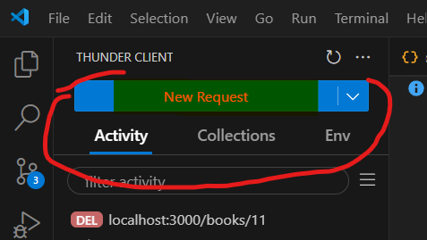
-**Esto debería salir en una ventana emergente**
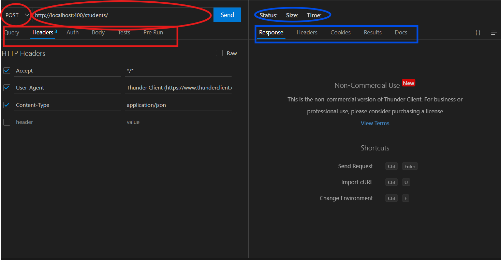
**EXPLICACIÓN RÁPIDA:**
-<span style="color:red">Circulo rojo:</span>   **Desplegable** en el que indicaremos la acción a enviar con **send**
-<span style="color:red">Elpse roja:</span>     **Bar** en la que pondremos la **URL**          
-<span style="color:red">Cuadrado rojo:</span>  **Apartados** a rellenar para la acción que fueramos ha hacer y recibir  
-<span style="color:blue">Circulo azul:</span>  **Estado, Tamaño y Tiempo** de la petición enviada
-<span style="color:blue">Cuadrado azul:</span> **Apartados** para ver los resultados de la peticion
**EJEMPLO RESPUESTA ESPERADA:**
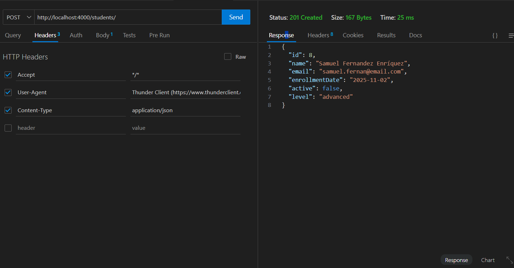
## 4.1 ⚙ Configuración

📁 Crear una colección llamada **"CRUD Students API"** -> 

🌍 Configurar un entorno de variables con:
- `baseUrl`
- `port`
- `fullUrl` (combinación de ambas)

---
### ***No se puede hacer en la prueba gratuita***
📸 Captura: 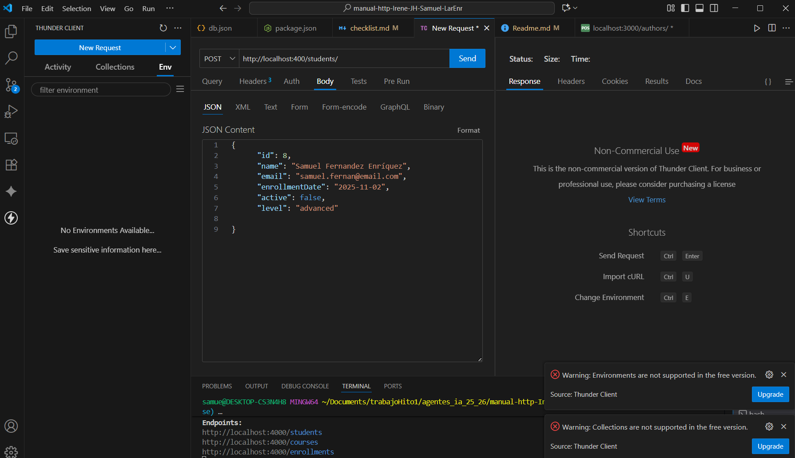

## 4.2 Peticiones

➕ **CREATE Student (POST)**  
Realizamos un **POST**, para crear un nuevo estudiante, lo enviaremos como **json** , y veremos lo que reciviremos.
Captura sobre el header del post: 
Captura sobre el body del post: 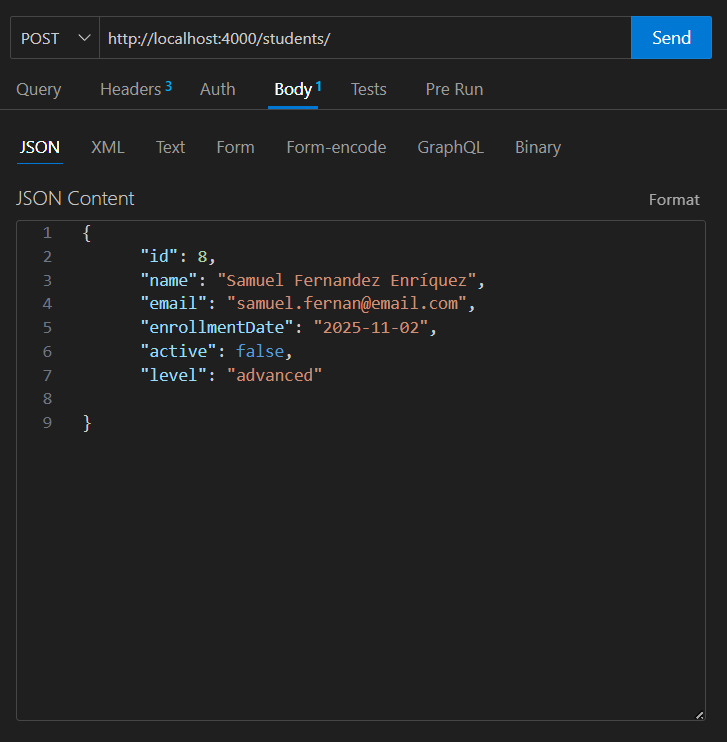
Captura sobre la respuesta del post: 
Captura sobre el header de la respuesta del post: 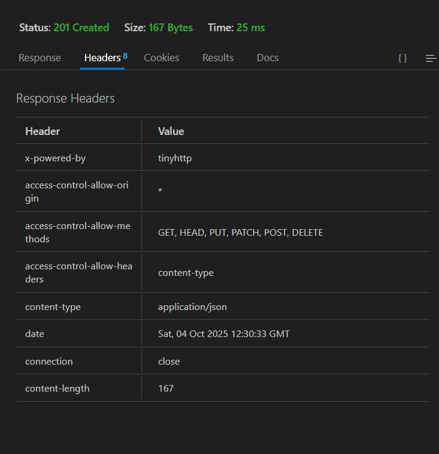
Captura sobre el cambio en la base de datos debido al post: 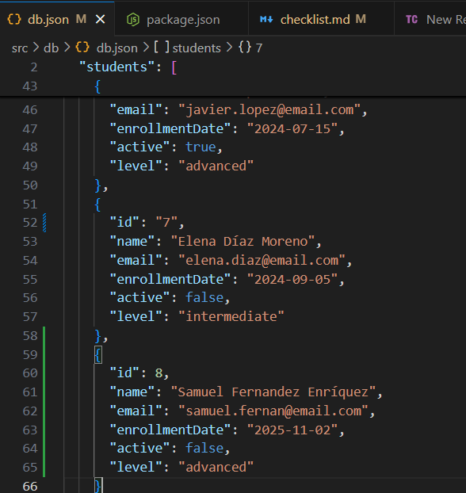

---
**¿content-Type application/json?**  

Es el tipo de datos que vamos a enviar en el cuerpo (**body**) de la petición.


📋 **GET All Students (GET)**
Hacemos un **GET** (un select) de todos los estudiantes simplemente poniendo la **URL:** ***http://localhost:4000/students/***.   

Captura del resultado y header del get sobre todos los students: 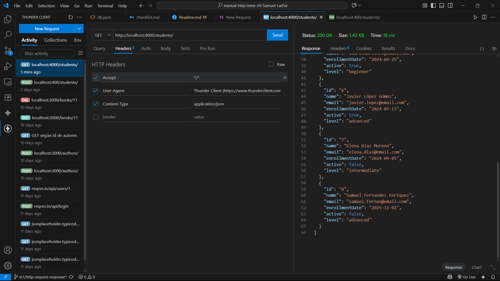
Captura de el header de la respuesta: 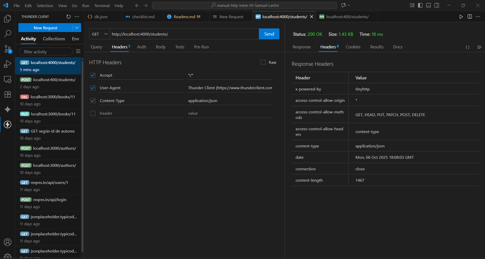

🔍 **GET Student by ID (GET)**
Hacemos un **GET**  de un  estudiante por **ID**  poniendo la **URL:** ***http://localhost:4000/students/(id)*** en este caso 8   

Captura de el header y la respuesta del resultado al get por id: 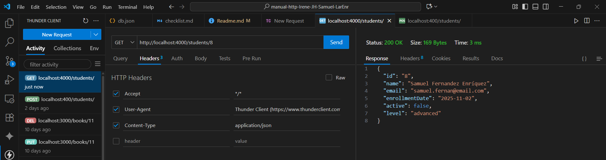
Captura del header del resultado: 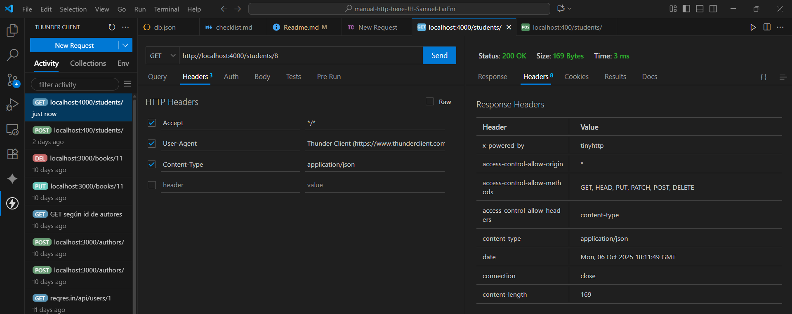

🔄 **UPDATE Student (PUT)**  
Hacemos un **PUT** (una actualización/update)  de un  estudiante  poniendo la **URL:** ***http://localhost:4000/students/(id)*** en este caso 8.   

Captura del body y el resultado: 
Captura de los headers de ambos: 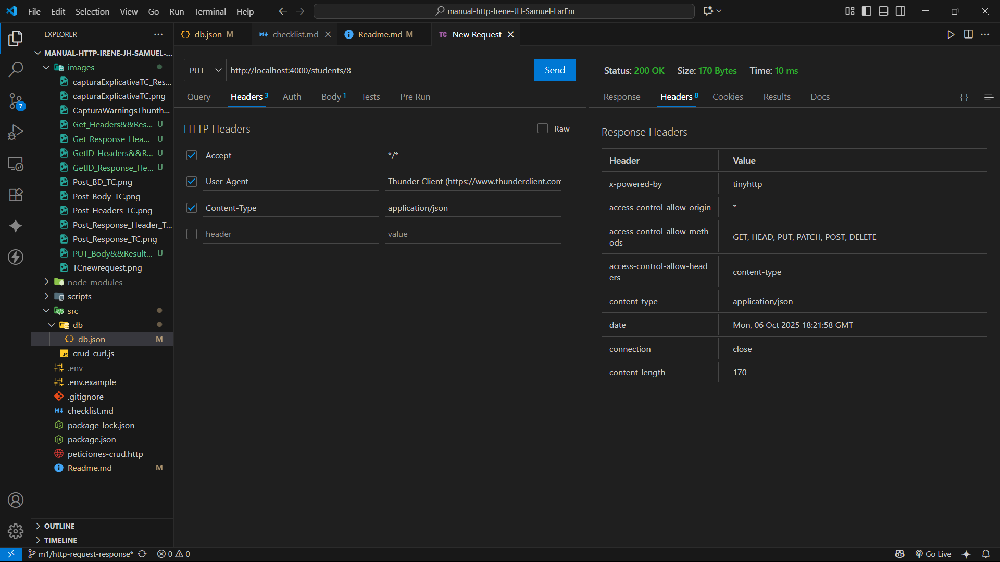
Captura del cambio realizado en la base de datos: 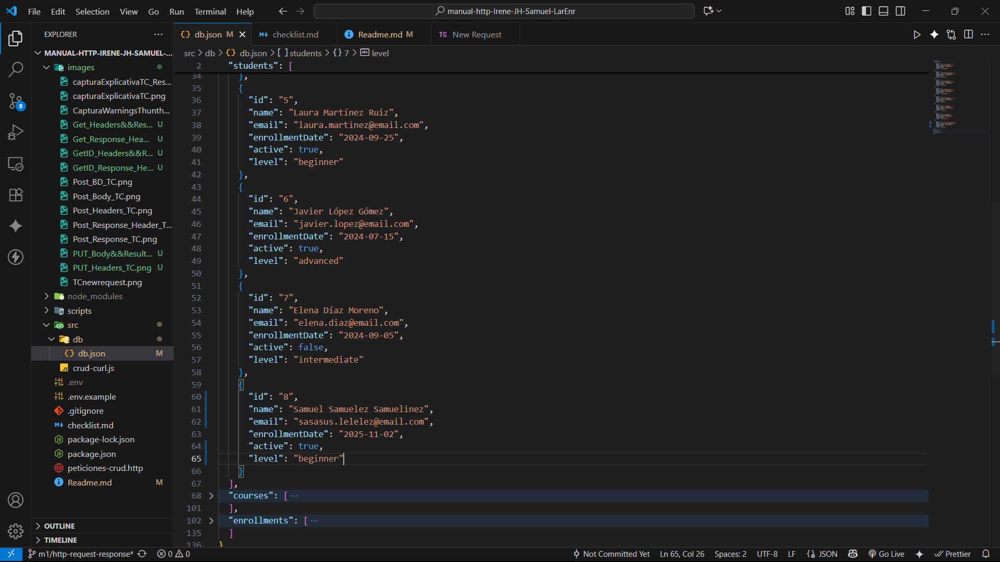

---
**Diferencia entre PATCH y PUT**
**PUT** cambia todo el recurso en este caso el estudiante, En cambio **PATCH** cambia solo los campos enviados.

---

✏ **PATCH Student (PATCH)**  
Hacemos un **Patch** (un "parche")  de un  estudiante  poniendo la **URL:** ***http://localhost:4000/students/(id)*** en este caso 8 y cambiando el solo el email.   

Captura del body y resultado del patch: 
Captura de los headers tanto del patch como del resultado: 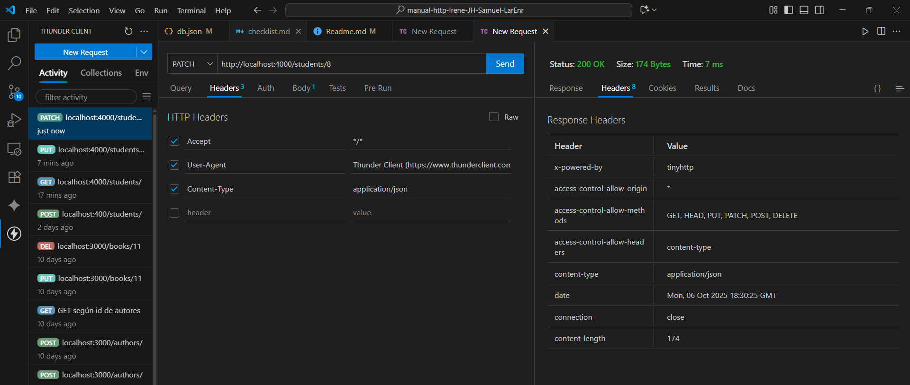
Captura del cambio en la base de datos: 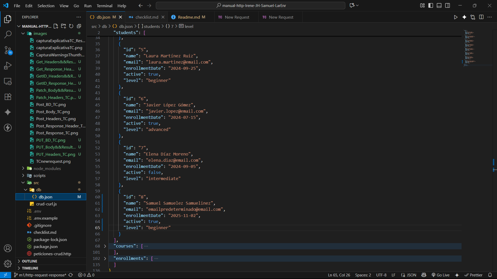


🗑 **DELETE Student (DELETE)** 
Hacemos un **DELETE** (un "borrado")  de un  estudiante  poniendo la **URL:** ***http://localhost:4000/students/(id)*** en este caso 8  

Captura del header y resultado del delete: 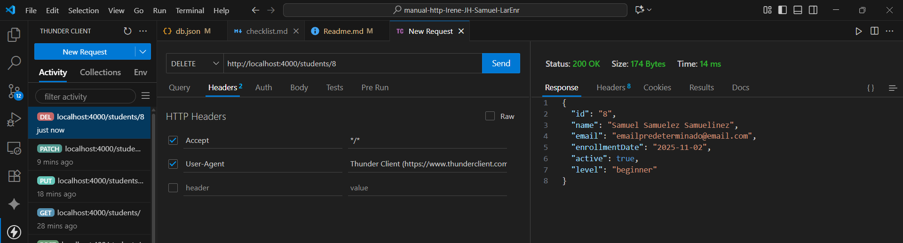
Captura del header del resultado del delete: 
Captura de el cambio realizado en la base de datos (borrar usuario id 8): 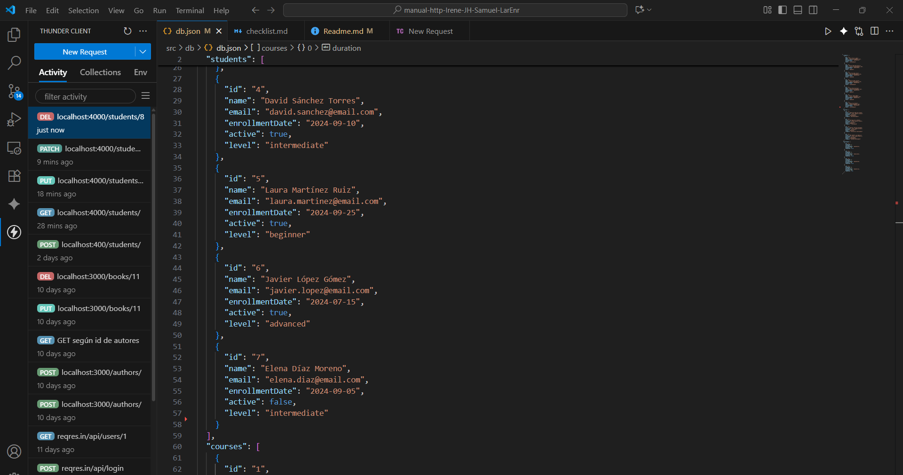

---

